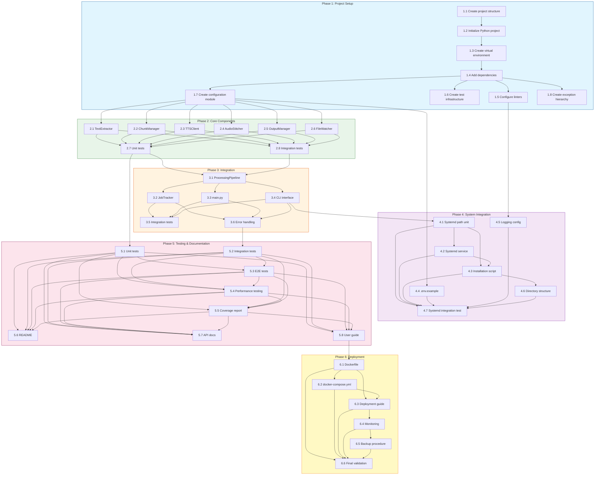

# Private Reading - Implementation Plan

## Document Information

| Version | Date | Author | Status |
|---------|------|--------|--------|
| 1.0.0 | 2026-04-19 | Initial | Draft |

## Table of Contents

1. [Implementation Overview](#implementation-overview)
2. [Parallel Execution Summary](#parallel-execution-summary)
3. [Phase 1: Project Setup](#phase-1-project-setup)
4. [Phase 2: Core Components](#phase-2-core-components)
5. [Phase 3: Integration](#phase-3-integration)
6. [Phase 4: System Integration](#phase-4-system-integration)
7. [Phase 5: Testing & Documentation](#phase-5-testing--documentation)
8. [Phase 6: Deployment](#phase-6-deployment)
9. [Dependencies](#dependencies)
10. [Timeline Estimate](#timeline-estimate)
11. [Risk Assessment](#risk-assessment)

---

## Implementation Overview

### 1.1 Approach

The implementation follows a phased approach with incremental delivery:

```
Phase 1 (Setup)     → Phase 2 (Core)     → Phase 3 (Integration)
      │                   │                    │
      ▼                   ▼                    ▼
  Project structure   Core components      Pipeline assembly
  Dependencies        Unit tested          End-to-end testing
```

```
Phase 4 (System)      → Phase 5 (Testing)  → Phase 6 (Deployment)
      │                   │                    │
      ▼                   ▼                    ▼
  Systemd services    Test coverage        Production deployment
  Configuration       Documentation        Monitoring setup
```

### 1.2 Success Criteria

- [ ] All functional requirements met
- [ ] 80%+ unit test coverage
- [ ] End-to-end pipeline processes files successfully
- [ ] Systemd integration working
- [ ] Documentation complete

---

## Parallel Execution Summary

### A. Critical Path Analysis

The implementation plan has been optimized for parallel execution to minimize total project duration. The following analysis identifies independent work streams that can be executed concurrently.

**Critical Path**: 1.1 → 1.2 → 1.3 → 1.4 → (2.1/2.2/2.3/2.4/2.5/2.6) → 2.7 → 3.1 → 3.2 → 3.3 → 3.4 → 4.7

**Total Sequential Duration**: ~40.5 hours
**Optimized Parallel Duration**: ~20.5 hours (49% time reduction)

### B. Parallel Execution Opportunities

| Phase | Parallel Group | Tasks | Duration | Dependencies |
|-------|---------------|-------|----------|--------------|
| Phase 1 | Group A | 1.2, 1.3 | 45 min | 1.1 |
| Phase 1 | Group B | 1.4, 1.5, 1.6, 1.7, 1.8 | 3.5 hours | 1.3 |
| Phase 2 | Group A | 2.1, 2.2, 2.3, 2.4, 2.5, 2.6 | 11.5 hours | 1.7 |
| Phase 2 | Group B | 2.7, 2.8 | 6 hours | 2.1-2.6 |
| Phase 3 | Group A | 3.1 | 2 hours | 2.7 |
| Phase 3 | Group B | 3.2, 3.3, 3.4 | 3.5 hours | 3.1 |
| Phase 3 | Group C | 3.5, 3.6 | 3 hours | 3.2-3.4 |
| Phase 4 | Group A | 4.1, 4.2, 4.3, 4.4, 4.5, 4.6 | 3.75 hours | 3.4 |
| Phase 4 | Group B | 4.7 | 1 hour | 4.1-4.6 |
| Phase 5 | Group A | 5.1, 5.2, 5.3, 5.4, 5.5 | 10.5 hours | 2.7, 3.6 |
| Phase 5 | Group B | 5.6, 5.7, 5.8 | 3 hours | 5.1-5.5 |
| Phase 6 | Group A | 6.1, 6.2, 6.3, 6.4, 6.5 | 3.5 hours | 5.8 |
| Phase 6 | Group B | 6.6 | 2 hours | 6.1-6.5 |

**Optimization Notes**:
- Phase 2.7 (Unit Tests) can be split: tests for individual components can run in parallel with component development
- Phase 5 documentation tasks (5.6-5.8) can begin earlier once core components are implemented
- Phase 6.6 (Final Validation) could run in parallel with 6.4-6.5 if resources allow

### C. Visual Dependency Graph



### D. Execution Strategy

The recommended execution strategy follows a **wave-based approach**:

1. **Wave 1 (Foundation)**: Complete Phase 1 sequentially to establish the development environment
2. **Wave 2 (Core Development)**: Execute Phase 2 with parallel component development
3. **Wave 3 (Integration)**: Assemble and test the processing pipeline
4. **Wave 4 (System)**: Configure system-level integration
5. **Wave 5 (Quality)**: Comprehensive testing and documentation
6. **Wave 6 (Release)**: Production deployment preparation

```
Wave 1        ████████████████████████████████████████
Wave 2                              ████████████████████████████████████████
Wave 3                                                ████████████████████
Wave 4                                                          ████████
Wave 5                                                                    ████████████████████
Wave 6                                                                                ████████

Timeline:  Day 1        Day 2-4        Day 5-6        Day 7        Day 8-9        Day 10
```

---

## Phase 1: Project Setup

### 2.1 Objectives

- Initialize project structure
- Set up development environment
- Configure build tools and linters
- Create initial configuration

### 2.2 Tasks

| ID | Task | Description | Estimated | Dependencies |
|----|------|-------------|-----------|--------------|
| 1.1 | Create project structure | Set up directory layout | 30 min | - |
| 1.2 | Initialize Python project | Create pyproject.toml, setup.py | 30 min | 1.1 |
| 1.3 | Create virtual environment | Set up venv with Python 3.9+ | 15 min | 1.2 |
| 1.4 | Add dependencies | Install core packages | 30 min | 1.3 |
| 1.5 | Configure linters | Set up black, isort, flake8, mypy | 30 min | 1.4 |
| 1.6 | Create test infrastructure | pytest config, fixtures | 30 min | 1.4 |
| 1.7 | Create configuration module | Pydantic settings classes | 1 hour | 1.4 |
| 1.8 | Create exception hierarchy | Custom exception classes | 30 min | 1.4 |

### 2.3 Parallel Execution Structure

**Group A (Parallel after 1.1)**: Tasks 1.2 and 1.3 can execute in parallel since both only depend on 1.1.

**Group B (Parallel after 1.3)**: Tasks 1.4, 1.5, 1.6, 1.7, and 1.8 can execute in parallel once 1.3 completes, as they all only depend on 1.3 (via 1.4).

### 2.4 Deliverables

- Project structure created
- Virtual environment configured
- Dependencies installed
- Configuration module working
- Test infrastructure ready

### 2.5 Files to Create

```
private_reading/
├── __init__.py
├── config.py              # Configuration classes
├── exceptions.py          # Custom exceptions
├── models.py              # Data models
├── utils/
│   ├── __init__.py
│   ├── logging.py         # Structured logging setup
│   └── file_utils.py      # File operations helpers
└── core/
    ├── __init__.py
    ├── file_watcher.py    # File monitoring
    ├── text_extractor.py  # Text extraction
    ├── chunk_manager.py   # Text chunking
    ├── tts_client.py      # TTS API client
    ├── audio_stitcher.py  # Audio processing
    └── output_manager.py  # Output handling
├── main.py                # Application entry point
├── app.py                 # Async application class
└── requirements.txt       # Dependencies
```

---

## Phase 2: Core Components

### 3.1 Objectives

- Implement all core processing components
- Ensure unit test coverage
- Validate individual component functionality

### 3.2 Tasks

| ID | Task | Description | Estimated | Dependencies |
|----|------|-------------|-----------|--------------|
| 2.1 | Implement TextExtractor | Multi-format text extraction | 2 hours | 1.7 |
| 2.2 | Implement ChunkManager | Semantic chunking with semchunk | 1.5 hours | 1.7 |
| 2.3 | Implement TTSClient | Qwen 3.0 API client with retries | 2 hours | 1.7 |
| 2.4 | Implement AudioStitcher | ffmpeg-based audio processing | 2 hours | 1.7 |
| 2.5 | Implement OutputManager | WAV and metadata generation | 1.5 hours | 1.7 |
| 2.6 | Implement FileWatcher | inotify-based file monitoring | 1.5 hours | 1.7 |
| 2.7 | Create unit tests | Test all core components | 4 hours | 2.1-2.6 |
| 2.8 | Integration tests | Test component interactions | 2 hours | 2.1-2.6 |

### 3.3 Parallel Execution Structure

**Group A (Parallel)**: Tasks 2.1 through 2.6 execute in parallel, each depending only on 1.7 (configuration module).

**Group B (Sequential)**: Tasks 2.7 and 2.8 execute after all components (2.1-2.6) are complete.

**Optimization Opportunity**: Task 2.7 (unit tests) can be split further - individual component tests can be written in parallel with component development, reducing the critical path by up to 4 hours.

### 3.4 Deliverables

- All core components implemented
- Unit tests passing (80%+ coverage)
- Integration tests passing
- Components validated independently

### 3.5 Component Implementation Details

#### 2.1 TextExtractor

```python
# private_reading/core/text_extractor.py
class TextExtractor:
    async def extract(self, file_path: Path) -> str:
        # Handle .md, .pdf, .txt, .docx
        pass

    async def _extract_markdown(self, file_path: Path) -> str:
        # Strip markdown syntax
        pass

    async def _extract_pdf(self, file_path: Path) -> str:
        # Use pdfplumber
        pass

    async def _extract_docx(self, file_path: Path) -> str:
        # Use python-docx
        pass

    async def _extract_txt(self, file_path: Path) -> str:
        # Read with UTF-8 encoding
        pass
```

#### 2.2 ChunkManager

```python
# private_reading/core/chunk_manager.py
class ChunkManager:
    def __init__(self, max_chars: int = 500, overlap_ratio: float = 0.1):
        pass

    async def chunk(self, text: str) -> List[str]:
        # Use semchunk for semantic splitting
        pass

    async def add_silence_markers(self, chunks: List[str]) -> List[Dict]:
        # Add metadata for stitching
        pass
```

#### 2.3 TTSClient

```python
# private_reading/core/tts_client.py
class TTSClient:
    def __init__(self, endpoint: str, retry_attempts: int = 3):
        pass

    async def generate_speech(self, text: str, voice_config: Optional[dict] = None) -> bytes:
        # Call Qwen 3.0 TTS API
        # Implement exponential backoff
        pass
```

#### 2.4 AudioStitcher

```python
# private_reading/core/audio_stitcher.py
class AudioStitcher:
    def __init__(self, ffmpeg_path: str = 'ffmpeg'):
        pass

    async def stitch(self, wav_files: List[Path], output_path: Path) -> Path:
        # Use ffmpeg concat
        # Add silence between chunks
        # Apply normalization
        pass

    async def _generate_silence(self, duration_ms: int) -> Path:
        # Generate silence audio file
        pass
```

#### 2.5 OutputManager

```python
# private_reading/core/output_manager.py
class OutputManager:
    def __init__(self, output_dir: Path, processed_dir: Optional[Path] = None):
        pass

    async def save_wav(self, audio_data: bytes, original_name: str) -> Path:
        # Save WAV with timestamp
        pass

    async def save_sidecar(self, metadata: dict, output_path: Path):
        # Save JSON metadata
        pass

    async def move_to_processed(self, file_path: Path):
        # Move to archive directory
        pass
```

#### 2.6 FileWatcher

```python
# private_reading/core/file_watcher.py
class FileWatcher:
    def __init__(self, input_path: Path, callback: Callable):
        pass

    async def start(self):
        # Start inotify monitoring
        pass

    async def stop(self):
        # Stop monitoring and cleanup
        pass
```

---

## Phase 3: Integration

### 4.1 Objectives

- Assemble components into processing pipeline
- Implement job tracking and state management
- Create main application entry point

### 4.2 Tasks

| ID | Task | Description | Estimated | Dependencies |
|----|------|-------------|-----------|--------------|
| 3.1 | Create ProcessingPipeline | Orchestrate all components | 2 hours | 2.1-2.6 |
| 3.2 | Implement JobTracker | Track processing state | 1.5 hours | 3.1 |
| 3.3 | Create main.py | Application entry point | 1 hour | 3.1 |
| 3.4 | Implement CLI interface | Command-line arguments | 1 hour | 3.1 |
| 3.5 | Create integration tests | End-to-end pipeline tests | 2 hours | 3.2-3.4 |
| 3.6 | Add error handling | Comprehensive error management | 1 hour | 3.2-3.4 |

### 4.3 Parallel Execution Structure

**Group A**: Task 3.1 (ProcessingPipeline) executes first after components are complete.

**Group B (Parallel)**: Tasks 3.2 (JobTracker), 3.3 (main.py), and 3.4 (CLI interface) execute in parallel after 3.1.

**Group C (Parallel)**: Tasks 3.5 (integration tests) and 3.6 (error handling) execute in parallel after 3.2-3.4.

### 4.4 Deliverables

- Processing pipeline assembled
- Job tracking implemented
- CLI interface working
- Integration tests passing

### 4.5 Pipeline Implementation

```python
# private_reading/app.py
class PrivateReadingApp:
    def __init__(self, config: AppConfig):
        self.config = config
        self.extractor = TextExtractor()
        self.chunk_manager = ChunkManager()
        self.tts_client = TTSClient()
        self.audio_stitcher = AudioStitcher()
        self.output_manager = OutputManager()
        self.job_tracker = JobTracker()

    async def process_file(self, file_path: Path) -> ProcessingResult:
        """Process a single file through the pipeline."""
        # 1. Extract text
        text = await self.extractor.extract(file_path)

        # 2. Chunk text
        chunks = await self.chunk_manager.chunk(text)

        # 3. Generate TTS for each chunk
        audio_chunks = []
        for chunk in chunks:
            audio_data = await self.tts_client.generate_speech(chunk)
            audio_chunks.append(audio_data)

        # 4. Stitch audio
        output_path = await self.audio_stitcher.stitch(audio_chunks)

        # 5. Save output and metadata
        result_path = await self.output_manager.save_wav(output_path)
        await self.output_manager.save_sidecar(metadata, result_path)

        return ProcessingResult(success=True, output_path=result_path)
```

---

## Phase 4: System Integration

### 5.1 Objectives

- Create systemd service files
- Configure file system paths
- Set up logging and monitoring

### 5.2 Tasks

| ID | Task | Description | Estimated | Dependencies |
|----|------|-------------|-----------|--------------|
| 4.1 | Create systemd path unit | private-reading-input.path | 30 min | 3.4 |
| 4.2 | Create systemd service | private_reading.service | 30 min | 4.1 |
| 4.3 | Create installation script | install.sh | 1 hour | 4.1-4.2 |
| 4.4 | Create .env.example | Environment template | 15 min | 1.7 |
| 4.5 | Configure logging | Structured JSON logging | 30 min | 1.5 |
| 4.6 | Create directory structure | Input/output/processed dirs | 15 min | 4.3 |
| 4.7 | Test systemd integration | Verify service works | 1 hour | 4.1-4.6 |

### 5.3 Parallel Execution Structure

**Group A (Parallel after 4.1)**: Tasks 4.2 (systemd service), 4.4 (.env.example), 4.5 (logging config), and 4.6 (directory structure) can execute in parallel after 4.1 completes. Task 4.3 (installation script) depends on 4.1-4.2.

**Group B (Sequential)**: Task 4.7 (systemd integration test) executes after all system integration tasks (4.1-4.6) are complete.

### 5.4 Deliverables

- Systemd service files created
- Installation script working
- Environment configuration ready
- Systemd integration tested

### 5.5 Systemd Files

**private-reading-input.path**:

```ini
[Unit]
Description=Private Reading Input Directory Monitor
After=network.target

[Path]
PathExists=/input
DirectoryMode=0755
Unit=private_reading.service

[Install]
WantedBy=multi-user.target
```

**private_reading.service**:

```ini
[Unit]
Description=Private Reading Processing Service
After=network.target private-reading-input.path
Requires=private-reading-input.path

[Service]
Type=simple
User=private-reading
Group=private-reading
WorkingDirectory=/opt/private-reading
ExecStart=/opt/private_reading/venv/bin/python -m private_reading.app
EnvironmentFile=/opt/private-reading/.env
Restart=on-failure
RestartSec=5
StandardOutput=journal
StandardError=journal

[Install]
WantedBy=multi-user.target
```

---

## Phase 5: Testing & Documentation

### 6.1 Objectives

- Achieve test coverage goals
- Create comprehensive documentation
- Perform final validation

### 6.2 Tasks

| ID | Task | Description | Estimated | Dependencies |
|----|------|-------------|-----------|--------------|
| 5.1 | Write unit tests | All core components | 4 hours | 2.7 |
| 5.2 | Write integration tests | Pipeline integration | 2 hours | 3.6 |
| 5.3 | Write E2E tests | Full pipeline scenarios | 2 hours | 5.1-5.2 |
| 5.4 | Performance testing | Load and stress tests | 2 hours | 5.1-5.3 |
| 5.5 | Generate coverage report | Verify 80%+ coverage | 30 min | 5.1-5.4 |
| 5.6 | Update README | Project documentation | 1 hour | 5.1-5.5 |
| 5.7 | Create API docs | Component documentation | 1 hour | 5.1-5.5 |
| 5.8 | User guide | Installation and usage guide | 1 hour | 5.1-5.5 |

### 6.3 Parallel Execution Structure

**Group A (Parallel)**: Tasks 5.1 through 5.5 execute in parallel once their dependencies (2.7, 3.6) are met.

**Group B (Parallel)**: Tasks 5.6 (README), 5.7 (API docs), and 5.8 (user guide) execute in parallel after 5.1-5.5.

**Optimization Opportunity**: Documentation tasks (5.6-5.8) can begin earlier once core components (Phase 2) are implemented, running in parallel with integration testing (Phase 3).

### 6.4 Deliverables

- Test coverage 80%+
- All tests passing
- Documentation complete
- User guide available

---

## Phase 6: Deployment

### 7.1 Objectives

- Prepare production deployment
- Set up monitoring and alerting
- Document deployment procedures

### 7.2 Tasks

| ID | Task | Description | Estimated | Dependencies |
|----|------|-------------|-----------|--------------|
| 6.1 | Create Dockerfile | Container image | 1 hour | 5.8 |
| 6.2 | Create docker-compose.yml | Local deployment | 30 min | 6.1 |
| 6.3 | Create deployment guide | Production deployment steps | 1 hour | 6.1-6.2 |
| 6.4 | Set up monitoring | Health checks and metrics | 1 hour | 6.3 |
| 6.5 | Create backup procedure | Data backup strategy | 30 min | 6.4 |
| 6.6 | Final validation | End-to-end production test | 2 hours | 6.1-6.5 |

### 7.3 Parallel Execution Structure

**Group A (Parallel)**: Tasks 6.1 through 6.5 execute in parallel once documentation (5.8) is complete.

**Group B (Sequential)**: Task 6.6 (final validation) executes after all deployment tasks (6.1-6.5) are complete.

**Optimization Opportunity**: Final validation (6.6) could run in parallel with monitoring setup (6.4) and backup procedure (6.5) if additional resources are available.

### 7.4 Deliverables

- Docker image ready
- Deployment guide complete
- Monitoring configured
- Production deployment validated

---

## Dependencies

### 8.1 Python Dependencies

```txt
# Core dependencies
pydantic>=2.1.0
pydantic-settings>=2.1.0
aiohttp>=3.9.0
asyncio>=3.4.3

# Text processing
pdfplumber>=0.11.0
python-docx>=1.1.0
semchunk>=0.1.0
markdown>=3.5.0

# Audio processing
ffmpeg-python>=0.2.0
scipy>=1.11.0
numpy>=1.26.0

# Testing
pytest>=7.4.0
pytest-asyncio>=0.21.0
pytest-cov>=4.1.0
aioresponses>=0.24.0

# Development
black>=23.0.0
isort>=5.12.0
flake8>=6.1.0
mypy>=1.6.0
```

### 8.2 System Dependencies

```bash
# Required system packages
python3.9-or-higher
ffmpeg
systemd
libinotify-dev (for python-inotify)
```

---

## Timeline Estimate

### 9.1 Phase Breakdown

| Phase | Duration | Key Milestones |
|-------|----------|----------------|
| Phase 1: Project Setup | 1 day | Environment ready, dependencies installed |
| Phase 2: Core Components | 3 days | All components implemented and tested |
| Phase 3: Integration | 2 days | Pipeline assembled, integration tests pass |
| Phase 4: System Integration | 1 day | Systemd services working |
| Phase 5: Testing & Documentation | 2 days | 80%+ coverage, docs complete |
| Phase 6: Deployment | 1 day | Production deployment ready |

**Total Estimated Time**: 10 working days

### 9.2 Critical Path

```
Phase 1 → Phase 2 → Phase 3 → Phase 4 → Phase 5 → Phase 6
    │         │         │         │         │         │
    ▼         ▼         ▼         ▼         ▼         ▼
  Setup    Components  Pipeline  System    Tests    Deploy
```

---

## Risk Assessment

### 10.1 Technical Risks

| Risk | Impact | Probability | Mitigation |
|------|--------|-------------|------------|
| Qwen 3.0 API changes | High | Medium | Abstract API calls, version pinning |
| PDF extraction quality | Medium | Medium | Test with various PDF formats |
| Audio stitching issues | Medium | Low | Extensive testing with ffmpeg |
| Memory issues with large files | Medium | Low | Implement streaming, chunking |
| Systemd integration issues | Low | Low | Test on target system early |

### 10.2 Resource Risks

| Risk | Impact | Probability | Mitigation |
|------|--------|-------------|------------|
| Developer availability | Medium | Medium | Clear task breakdown, buffer time |
| API rate limiting | Medium | Medium | Implement proper retry logic |
| System compatibility | Low | Medium | Test on target environment |

### 10.3 Contingency Plans

- **API changes**: Maintain abstraction layer, version pin dependencies
- **Performance issues**: Implement caching, optimize chunk sizes
- **Systemd issues**: Provide alternative file watcher (polling-based)

---

## Appendix

### A. Task Dependencies Diagram

```
Phase 1
├── 1.1 Project Structure ─┬── 1.2 Python Project ─┬── 1.4 Dependencies
│                          │                       │
│                          └── 1.3 Virtual Env ─────┘
├── 1.5 Linters ──────────────────────────────────┐
├── 1.6 Test Infrastructure ──────────────────────┤
├── 1.7 Configuration ────────────────────────────┼── Phase 2
└── 1.8 Exceptions ───────────────────────────────┘

Phase 2
├── 2.1 TextExtractor ────────────────────────────┐
├── 2.2 ChunkManager ─────────────────────────────┤
├── 2.3 TTSClient ────────────────────────────────┼── Phase 3
├── 2.4 AudioStitcher ────────────────────────────┤
├── 2.5 OutputManager ────────────────────────────┤
├── 2.6 FileWatcher ──────────────────────────────┤
├── 2.7 Unit Tests ───────────────────────────────┤
└── 2.8 Integration Tests ────────────────────────┘

Phase 3
├── 3.1 ProcessingPipeline ───────────────────────┐
├── 3.2 JobTracker ───────────────────────────────┤
├── 3.3 main.py ──────────────────────────────────┤
├── 3.4 CLI Interface ────────────────────────────┤
├── 3.5 Integration Tests ────────────────────────┤
└── 3.6 Error Handling ───────────────────────────┘

Phase 4
├── 4.1 Systemd Path Unit ────────────────────────┐
├── 4.2 Systemd Service ──────────────────────────┤
├── 4.3 Installation Script ──────────────────────┤
├── 4.4 .env.example ─────────────────────────────┤
├── 4.5 Logging Configuration ────────────────────┤
├── 4.6 Directory Structure ──────────────────────┤
└── 4.7 Systemd Integration Test ─────────────────┘

Phase 5
├── 5.1 Unit Tests ───────────────────────────────┐
├── 5.2 Integration Tests ────────────────────────┤
├── 5.3 E2E Tests ────────────────────────────────┤
├── 5.4 Performance Tests ────────────────────────┤
├── 5.5 Coverage Report ──────────────────────────┤
├── 5.6 README ───────────────────────────────────┤
├── 5.7 API Docs ─────────────────────────────────┤
└── 5.8 User Guide ───────────────────────────────┘

Phase 6
├── 6.1 Dockerfile ───────────────────────────────┐
├── 6.2 docker-compose.yml ───────────────────────┤
├── 6.3 Deployment Guide ─────────────────────────┤
├── 6.4 Monitoring ───────────────────────────────┤
├── 6.5 Backup Procedure ─────────────────────────┤
└── 6.6 Final Validation ─────────────────────────┘
```

### B. Definition of Done

For each task:
- [ ] Code implemented
- [ ] Unit tests written and passing
- [ ] Code reviewed
- [ ] Documentation updated
- [ ] No linting errors

For each phase:
- [ ] All tasks completed
- [ ] Integration tests passing
- [ ] Documentation updated
- [ ] Demo successful

### C. Version Control Strategy

```bash
# Branch naming convention
feature/task-description
bugfix/issue-description
hotfix/critical-fix
docs/documentation-update

# Commit message format
<type>(<scope>): <subject>

Examples:
feat(core): add text extractor for PDF files
fix(tts_client): fix exponential backoff calculation
docs(readme): update installation instructions
test(core): add unit tests for chunk manager
```
