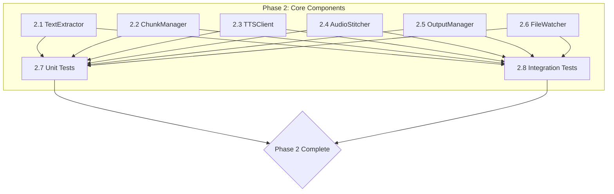

# Phase 2: Core Components - Implementation Plan

## Overview

Implement all 6 core processing components with full functionality and comprehensive tests.

## Current State

All components exist as skeleton classes with `NotImplementedError` stubs:
- [`TextExtractor`](core/text_extractor.py) - Format routing only
- [`ChunkManager`](core/chunk_manager.py) - Configuration only
- [`TTSClient`](core/tts_client.py) - Context manager stubs
- [`AudioStitcher`](core/audio_stitcher.py) - Method signatures only
- [`OutputManager`](core/output_manager.py) - Directory creation only
- [`FileWatcher`](core/file_watcher.py) - Event processing stubs

## Task Breakdown

### Task 2.1: TextExtractor Implementation (2 hours)

**File:** `core/text_extractor.py`

Implement:
- `_extract_markdown()` - Strip markdown syntax (headers, bold, italic, code blocks, lists)
- `_extract_pdf()` - Use pdfplumber for text extraction
- `_extract_txt()` - Read with UTF-8 encoding
- `_extract_docx()` - Use python-docx for paragraph extraction

**Key behaviors:**
- Markdown: Remove `#`, `**`, `*`, ```, `- `, list markers
- PDF: Preserve reading order using pdfplumber
- TXT: UTF-8 encoding with fallback
- DOCX: Extract paragraph text preserving flow

### Task 2.2: ChunkManager Implementation (1.5 hours)

**File:** `core/chunk_manager.py`

Implement:
- `chunk()` - Use semchunk for semantic splitting
- `add_silence_markers()` - Add metadata dict with `has_silence_before` field
- `calculate_overlap()` - Return `int(max_chars * overlap_ratio)`

**Key behaviors:**
- Max chunk size: 500 chars (configurable)
- Overlap: 10% of max_chars
- First chunk has no silence before it
- Other chunks have `has_silence_before=True`

### Task 2.3: TTSClient Implementation (2 hours)

**File:** `core/tts_client.py`

Implement:
- `__aenter__()` / `__aexit__()` - Async context manager with aiohttp session
- `generate_speech()` - POST to TTS API with retry logic
- `_handle_retry()` - Handle 429 (retry_after) and 5xx errors
- `_calculate_backoff()` - Exponential backoff with jitter

**Key behaviors:**
- Endpoint: `http://192.168.1.104:8008/v1/audio/speech`
- Max retries: 3 attempts
- Backoff: 2^attempt * 1000ms with jitter
- Request body: JSON with text, voice_config
- Response: audio bytes from JSON `audio` field

### Task 2.4: AudioStitcher Implementation (2 hours)

**File:** `core/audio_stitcher.py`

Implement:
- `stitch()` - ffmpeg concat demuxer with silence insertion
- `add_silence()` - Generate silence WAV using ffmpeg
- `normalize_audio()` - Apply loudnorm filter

**Key behaviors:**
- Create concat list file for ffmpeg
- Insert silence WAV between chunks when `add_silence_between=True`
- Silence duration: 500ms (configurable)
- Normalization: loudness -16 LUFS, true peak -2 dB, range 11 dB

### Task 2.5: OutputManager Implementation (1.5 hours)

**File:** `core/output_manager.py`

Implement:
- `save_wav()` - Write audio bytes to WAV file with timestamp naming
- `save_sidecar()` - Write JSON metadata alongside WAV
- `move_to_processed()` - Move file to processed/archive directory

**Key behaviors:**
- Naming: `{original_name}_{timestamp}.wav`
- Sidecar: `{original_name}_{timestamp}.json`
- Metadata includes: source_file, word_count, chunk_count, duration, voice_config, processing_time, status

### Task 2.6: FileWatcher Implementation (1.5 hours)

**File:** `core/file_watcher.py`

Implement:
- `start()` - Initialize inotify watcher on input directory
- `stop()` - Clean up watcher resources
- `_process_events()` - Handle CLOSE_WRITE events

**Key behaviors:**
- Use `pyinotify` or `inotify-simple` for file monitoring
- Watch for CLOSE_WRITE events (file fully written)
- Trigger callback with Path to new file
- Handle directory creation

### Task 2.7: Unit Tests (4 hours)

**Files:** `tests/core/test_*.py`

Implement tests per test-plan.md:

| Component | Tests |
|-----------|-------|
| text_extractor | 18 tests (UT-TE-001 through UT-TE-018) |
| chunk_manager | 10 tests (UT-CM-001 through UT-CM-010) |
| tts_client | 12 tests (UT-TTC-001 through UT-TTC-012) |
| audio_stitcher | 10 tests (UT-AS-001 through UT-AS-010) |
| output_manager | 13 tests (UT-OM-001 through UT-OM-013) |
| file_watcher | 8 tests (UT-FW-001 through UT-FW-008) |

### Task 2.8: Integration Tests (2 hours)

**Files:** `tests/core/test_pipeline_integration.py`

Implement pipeline integration tests:
- Full pipeline processing (IT-PP-001 through IT-PP-010)
- Component interaction validation

## Execution Strategy

Since this is Phase 2 and all components depend only on 1.7 (configuration module which is complete), Tasks 2.1-2.6 can execute in parallel.



## Mode Coordination

1. **Ask Mode** - Review design, clarify requirements, validate approach
2. **Code Mode** - Implement all 6 components + tests
3. **QA-Test Mode** - Verify implementations, run tests, validate coverage

## Dependencies

- Phase 1 complete (config module at `private_reading/config.py`)
- Dependencies in `requirements.txt` installed
- Virtual environment active
