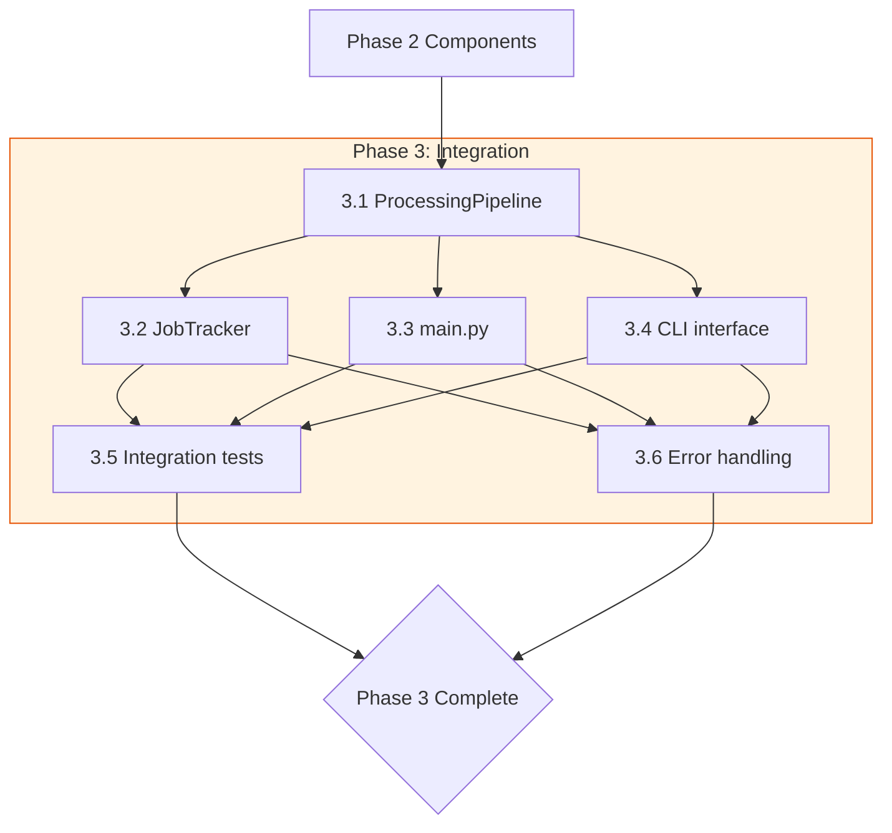

# Phase 3: Integration - Implementation Plan

## Overview

Assemble all Phase 2 core components into a cohesive processing pipeline with job tracking, CLI interface, and comprehensive error handling. This phase transforms individual components into a working application.

## Current State

All 6 Phase 2 core components are implemented and unit-tested:

- [`TextExtractor`](core/text_extractor.py) - Multi-format text extraction (Markdown, PDF, TXT, DOCX)
- [`ChunkManager`](core/chunk_manager.py) - Semantic chunking with semchunk
- [`TTSClient`](core/tts_client.py) - Qwen 3.0 API client with retry logic
- [`AudioStitcher`](core/audio_stitcher.py) - ffmpeg-based audio processing
- [`OutputManager`](core/output_manager.py) - WAV and metadata generation
- [`FileWatcher`](core/file_watcher.py) - inotify-based file monitoring

## Task Breakdown

### Task 3.1: ProcessingPipeline Implementation (2 hours)

**File:** `myaudible/core/pipeline.py` (new file)

Implement the `ProcessingPipeline` class that orchestrates all Phase 2 components in the correct workflow sequence.

**Subtasks:**

1. Create `ProcessingPipeline` class with component initialization
   - Accept `AppConfig` in configuration
   - Instantiate all 6 Phase 2 components as instance attributes
   - Store job tracker reference

2. Implement `process_file()` async method
   - Step 1: Call `TextExtractor.extract(file_path)` to get text
   - Step 2: Call `ChunkManager.chunk(text)` to get text chunks
   - Step 3: For each chunk, call `TTSClient.generate_speech(chunk)` to get audio bytes
   - Step 4: Call `AudioStitcher.stitch(audio_chunks, output_path)` to combine audio
   - Step 5: Call `OutputManager.save_wav(audio_data, original_name)` to save output
   - Step 6: Call `OutputManager.save_sidecar(metadata, output_path)` to save metadata
   - Step 7: Call `OutputManager.move_to_processed(source_file)` to archive input
   - Return `ProcessingResult` with success status and output path

3. Implement `process_directory()` async method (optional convenience method)
   - Scan input directory for supported file types
   - Process each file sequentially
   - Return list of `ProcessingResult` objects

4. Implement `get_status()` method
   - Return current pipeline state
   - Include component health checks

**Key behaviors:**
- Pipeline processes files in order: extract → chunk → TTS → stitch → save
- Each step should be logged with timing information
- Pipeline should be reusable (can process multiple files)
- Async/await throughout for non-blocking I/O

**Acceptance Criteria:**
- [ ] `ProcessingPipeline` class instantiates with config
- [ ] `process_file()` successfully processes a markdown file end-to-end
- [ ] `process_file()` successfully processes a txt file end-to-end
- [ ] Returns `ProcessingResult` with correct output path
- [ ] Logs each pipeline stage with timing
- [ ] Handles empty input directory gracefully

### Task 3.2: JobTracker Implementation (1.5 hours)

**File:** `myaudible/core/job_tracker.py` (new file)

Implement job tracking to monitor processing state and provide visibility into pipeline operations.

**Subtasks:**

1. Create `JobTracker` class with state management
   - Track jobs by unique ID (UUID)
   - Store job state: `PENDING`, `PROCESSING`, `COMPLETED`, `FAILED`
   - Track start time, end time, duration

2. Implement `create_job()` method
   - Generate unique job ID
   - Initialize job record with source file path
   - Set initial state to `PENDING`
   - Return job ID

3. Implement state transition methods
   - `start_job(job_id)` - Transition to `PROCESSING`
   - `complete_job(job_id, result)` - Transition to `COMPLETED`
   - `fail_job(job_id, error)` - Transition to `FAILED`

4. Implement query methods
   - `get_job(job_id)` - Get job details
   - `list_jobs()` - List all jobs
   - `get_jobs_by_status(status)` - Filter by status

5. Implement persistence (optional)
   - Save job history to JSON file
   - Load job history on initialization

**Key behaviors:**
- Thread-safe state transitions
- Job IDs are UUIDs
- Job records include: id, source_file, status, created_at, started_at, completed_at, duration, error (if failed), result (if completed)
- Default storage is in-memory dict; optional JSON file persistence

**Acceptance Criteria:**
- [ ] `JobTracker` creates jobs with unique IDs
- [ ] State transitions follow valid paths only
- [ ] Job history persists across restarts (if persistence enabled)
- [ ] Query methods return correct filtered results
- [ ] Tracks processing duration accurately

### Task 3.3: main.py Application Entry Point (1 hour)

**File:** `myaudible/app.py` (modify existing)

Create the main application class that ties everything together.

**Subtasks:**

1. Create `MyAudibleApp` class
   - Accept `AppConfig` in constructor
   - Initialize all components including `ProcessingPipeline` and `JobTracker`

2. Implement `run()` async method
   - Parse command-line arguments (delegated to CLI)
   - Initialize logging from config
   - Start file watcher if configured
   - Run event loop

3. Implement `process_single_file()` method
   - Create job in JobTracker
   - Execute ProcessingPipeline
   - Update job status
   - Return result

4. Implement health check endpoint/method
   - Return component status
   - Return job statistics

**Key behaviors:**
- Application is configurable via `AppConfig`
- Supports both single-file processing and file-watcher mode
- Clean startup and shutdown

**Acceptance Criteria:**
- [ ] `MyAudibleApp` initializes all components from config
- [ ] `run()` starts the application
- [ ] Single file processing works via CLI
- [ ] File watcher mode works when enabled
- [ ] Clean shutdown on SIGINT/SIGTERM

### Task 3.4: CLI Interface (1 hour)

**File:** `myaudible/cli.py` (new file)

Implement command-line interface using Python's `argparse` module.

**Subtasks:**

1. Create argument parser
   - `--config` or `-c` - Path to config file (optional)
   - `--input` or `-i` - Input file or directory path
   - `--output` or `-o` - Output directory path
   - `--voice` - Voice ID for TTS (default from config)
   - `--chunk-size` - Override max chunk size
   - `--overlap-ratio` - Override overlap ratio
   - `--verbose` or `-v` - Enable verbose logging
   - `--watch` or `-w` - Enable file watcher mode

2. Implement `main()` entry point
   - Parse arguments
   - Load config (from file or defaults)
   - Initialize and run application

3. Implement subcommands (optional future extension)
   - `process` - Process a file/directory
   - `watch` - Watch a directory
   - `status` - Show job status
   - `jobs` - List jobs

**Key behaviors:**
- CLI arguments override config file values
- Helpful error messages for invalid inputs
- `--help` shows comprehensive usage information

**Acceptance Criteria:**
- [ ] `python -m myaudible --help` shows usage
- [ ] `python -m myaudible -i /path/to/file.md` processes file
- [ ] `python -m myaudible -i /path/to/dir -w` watches directory
- [ ] `--verbose` enables debug logging
- [ ] Invalid inputs show helpful error messages

### Task 3.5: Integration Tests (2 hours)

**File:** `tests/core/test_pipeline_integration.py` (modify existing)

Implement end-to-end integration tests for the processing pipeline.

**Subtasks:**

1. Test pipeline initialization
   - `test_pipeline_init()` - Pipeline creates with config
   - `test_pipeline_components()` - All components instantiated

2. Test full pipeline processing
   - `test_process_markdown_file()` - End-to-end markdown processing
   - [ ] `test_process_txt_file()` - End-to-end txt processing
   - `test_process_pdf_file()` - End-to-end pdf processing (if pdfplumber available)
   - `test_process_docx_file()` - End-to-end docx processing (if python-docx available)

3. Test chunking and stitching
   - `test_chunking_with_overlap()` - Chunks have correct overlap
   - `test_audio_stitching()` - Audio chunks combine correctly
   - `test_silence_insertion()` - Silence added between chunks

4. Test output generation
   - `test_wav_output_created()` - WAV file exists after processing
   - `test_sidecar_metadata()` - JSON sidecar has correct data
   - `test_file_moved_to_processed()` - Input moved to archive

5. Test job tracking integration
   - `test_job_tracker_integration()` - Jobs tracked during processing
   - `test_job_status_updates()` - Status transitions correctly

6. Test error scenarios
   - `test_invalid_file_format()` - Handles unsupported formats
   - `test_missing_input_file()` - Handles non-existent files
   - `test_tts_api_failure()` - Handles TTS API errors gracefully

**Key test patterns:**
- Use `pytest-asyncio` for async tests
- Use `aioresponses` to mock TTS API calls
- Use temporary directories for file I/O tests
- Use fixtures for common setup

**Acceptance Criteria:**
- [ ] All integration tests pass
- [ ] Tests use mocks for external API calls
- [ ] Tests use temp directories for file operations
- [ ] Test coverage for pipeline.py > 90%
- [ ] Tests validate data flow between components

### Task 3.6: Error Handling (1 hour)

**File:** `myaudible/exceptions.py` (modify existing), `myaudible/core/pipeline.py` (modify)

Implement comprehensive error handling throughout the pipeline.

**Subtasks:**

1. Define custom exception hierarchy
   - `MyAudibleError` (base)
   - `ExtractionError` - Text extraction failures
   - `ChunkingError` - Chunking failures
   - `TTSError` - TTS API failures
   - `AudioError` - Audio processing failures
   - `OutputError` - Output/metadata failures
   - `PipelineError` - Pipeline orchestration failures

2. Implement error handling in ProcessingPipeline
   - Catch component-specific exceptions
   - Log errors with context (file path, stage, error message)
   - Update job status on failure
   - Clean up partial outputs on failure

3. Implement retry logic for transient errors
   - Retry TTS failures (already in TTSClient)
   - Retry file I/O failures
   - Max retries: 3 with exponential backoff

4. Implement graceful degradation
   - Skip unsupported file formats with warning
   - Continue processing remaining files if one fails (batch mode)
   - Report summary of successes/failures

**Key behaviors:**
- All errors are logged with structured context
- User receives meaningful error messages
- Partial processing doesn't leave system in inconsistent state
- Job tracker reflects final state (success or failure)

**Acceptance Criteria:**
- [ ] Custom exception hierarchy defined
- [ ] Pipeline catches and handles component errors
- [ ] Failed jobs marked as FAILED in JobTracker
- [ ] Partial outputs cleaned up on failure
- [ ] Error messages are actionable
- [ ] Retry logic works for transient errors

## Execution Strategy

### Execution Groups

| Group | Tasks | Duration | Dependencies | Notes |
|-------|-------|----------|--------------|-------|
| **A** | 3.1 ProcessingPipeline | 2 hours | 2.1-2.6 (all Phase 2 components) | Sequential - must complete first |
| **B** | 3.2 JobTracker<br>3.3 main.py<br>3.4 CLI interface | 3.5 hours | 3.1 | Parallel execution |
| **C** | 3.5 Integration tests<br>3.6 Error handling | 3 hours | 3.2-3.4 | Parallel execution |

### Visual Dependency Graph



### Recommended Execution Order

1. **Start with Group A**: Implement `ProcessingPipeline` first as it's the foundation for everything else
2. **Move to Group B** (parallel): Once pipeline is done, implement JobTracker, main.py, and CLI interface in parallel
3. **Finish with Group C** (parallel): Once Group B is complete, implement integration tests and error handling in parallel

## Mode Coordination

1. **Ask Mode** - Review pipeline design, clarify component interaction patterns
2. **Code Mode** - Implement all 6 Phase 3 tasks
3. **QA-Test Mode** - Verify integration tests pass, validate end-to-end workflow

## Dependencies

- Phase 2 complete (all 6 core components implemented and unit-tested)
- Phase 2 integration tests passing (`tests/core/test_pipeline_integration.py`)
- Dependencies in `requirements.txt` installed
- Virtual environment active
- ffmpeg installed on system (for audio stitching tests)

## File Summary

### New Files to Create

| File | Purpose | Task |
|------|---------|------|
| `myaudible/core/pipeline.py` | ProcessingPipeline class | 3.1 |
| `myaudible/core/job_tracker.py` | Job tracking and state management | 3.2 |
| `myaudible/cli.py` | Command-line interface | 3.4 |

### Files to Modify

| File | Purpose | Task |
|------|---------|------|
| `myaudible/app.py` | Application entry point | 3.3 |
| `myaudible/exceptions.py` | Custom exception hierarchy | 3.6 |
| `tests/core/test_pipeline_integration.py` | Integration tests | 3.5 |

## Component Integration Reference

The `ProcessingPipeline` integrates these Phase 2 components:

```python
class ProcessingPipeline:
    def __init__(self, config: AppConfig):
        self.config = config
        self.extractor = TextExtractor()
        self.chunk_manager = ChunkManager()
        self.tts_client = TTSClient()
        self.audio_stitcher = AudioStitcher()
        self.output_manager = OutputManager()
        self.job_tracker = JobTracker()
    
    async def process_file(self, file_path: Path) -> ProcessingResult:
        # 1. Extract
        text = await self.extractor.extract(file_path)
        
        # 2. Chunk
        chunks = await self.chunk_manager.chunk(text)
        
        # 3. TTS (per chunk)
        audio_chunks = []
        for chunk in chunks:
            audio_data = await self.tts_client.generate_speech(chunk)
            audio_chunks.append(audio_data)
        
        # 4. Stitch
        output_path = await self.audio_stitcher.stitch(audio_chunks)
        
        # 5. Save
        result_path = await self.output_manager.save_wav(output_path)
        await self.output_manager.save_sidecar(metadata, result_path)
        
        return ProcessingResult(success=True, output_path=result_path)
```
