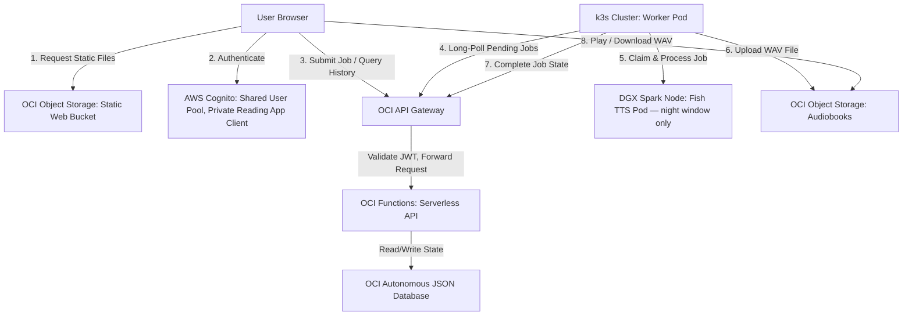

# Technical Specification: Private Reading Enhancement

A private audiobook service where authenticated users submit text through a static web application. The app delegates generation to a local TTS server via a serverless polling model, and stores the resulting audiobooks on OCI Object Storage for playback and download. It is the second entry in a two-app development portfolio; the first is Know-It-All Tutor. Both apps share the same AWS Cognito User Pool and a common dark-navy visual design language.

---

## 1. System Topology



---

## 2. Component Design

### 2.1 Web UI

- **Deployment**: Hosted as static assets on an Always Free OCI Object Storage bucket configured for web hosting.
- **Tech Stack**: Pure HTML5, Tailwind CSS (via CDN), and vanilla ES6 JavaScript. No bundlers required, ensuring zero-overhead static deployment.
- **Visual Design**: Matches the dark-navy aesthetic of Know-It-All Tutor — consistent palette, typography, and component style across both portfolio apps.
- **UX Layout & Navigation**:
  - **Unauthenticated state**: Redirects to the Cognito Hosted UI. On return, exchanges the authorization code for tokens and stores the JWT in `localStorage`.
  - **Persistent top nav bar** (mirrors Know-It-All Tutor structure): brand name left, nav links center/right, user/logout control far right. Two nav destinations:
    - **New Audiobook** *(default authenticated view)*: A large `<textarea>` with real-time character limit validation and a "Generate Audiobook" submission button. Visual baseline matches the existing local tool at `localhost:7860`. If a job is already in progress, the submission button is disabled until it completes or fails.
    - **My Audiobook**: Displays the single current or most recently completed job — its status (`Queued`, `Processing`, `Completed`, `Failed`) and, on completion, an HTML5 `<audio>` player and a "Download" button. The download URL is fetched fresh from `GET /jobs/current/url` each time the view loads (1-hour TTL pre-signed URL), so the link remains valid for the full 48-hour file retention window. Once the user downloads or dismisses it, the stored WAV is deleted immediately.
  - Client-side JS swaps the view content without a page reload; no router library required.

### 2.2 Authentication & Authorization (AWS Cognito)

User identity is federated through the **existing AWS Cognito User Pool** shared with Know-It-All Tutor. Private Reading is registered as a second app client in that same User Pool — no new User Pool is provisioned.

- **App client**: A new Cognito app client is created for Private Reading with its own `client_id`, callback URL, and allowed OAuth scopes. The User Pool itself (users, password policy, MFA settings) is unchanged.
- **User provisioning**: Reuses the existing approval flow from Know-It-All Tutor — a prospective user requests access via email, which routes to the admin for approval before a Cognito account is created. Self-service sign-up remains disabled in the User Pool.
- **Sign-in flow**: OAuth 2.0 Authorization Code + PKCE via the Cognito Hosted UI. After successful login, Cognito issues a signed JWT (ID token + access token) scoped to the Private Reading app client.
- **Token validation**: The OCI API Gateway JWT authorizer is pointed at the shared User Pool's JWKS endpoint (`https://cognito-idp.{region}.amazonaws.com/{userPoolId}/.well-known/jwks.json`). All user-facing API routes require a valid `Authorization: Bearer <access_token>` header; the gateway rejects requests that fail validation before they reach OCI Functions.
- **User identity in the backend**: OCI Functions extract the `sub` claim from the validated token to scope all data operations to the requesting user. Cognito is the source of truth for identity — no user records are stored independently.
- **Token refresh**: The SPA silently renews access tokens using the Cognito refresh token (stored in `localStorage`) before expiry.

### 2.3 Secure Local TTS Integration: Polling Worker Model

Rather than exposing the home server via VPN tunnels, reverse SSH, or open ports, the system uses a **pull-based polling worker** running as a Kubernetes Deployment on the home k3s cluster (see §2.7).

- **Authentication**: Worker-facing API routes use **OCI request signing** as their authorizer — separate from the Cognito JWT authorizer on user-facing routes. OCI request signing uses the same RSA key pair already registered in the OCI console for CLI/SDK access, so no new credentials are needed.
- The worker is a new `worker/` module in the `myaudible` repo — a new entry point that drives the existing `private_reading` pipeline (`pipeline.py` → `chunk_manager.py` → `tts_client.py` → `audio_stitcher.py`) with no changes to the pipeline code itself.
- The worker runs **24/7** as a K8s Deployment (replica=1). It references the TTS server at `fish-tts.default.svc.cluster.local:8013` — a standard K8s `ClusterIP` Service backed by the Fish TTS Deployment on the DGX Spark node. No LAN IPs are hard-coded anywhere.
- When a job is available, the worker:
  1. Claims the job via `POST /worker/jobs/{job_id}/claim`.
  2. Passes the job text into the existing pipeline.
  3. Uploads the final WAV directly to the OCI Object Storage Audiobooks bucket.
  4. Calls `POST /worker/jobs/{job_id}/complete` with the destination object path.
- **TTS unavailability**: When Fish TTS is not running (daytime), the worker catches the connection error, releases the claim (transitions job back to `queued`), and backs off before polling again. Jobs queue during the day and drain automatically when Fish TTS starts at night. The existing `TTS_RETRY_ATTEMPTS` / `TTS_BASE_BACKOFF_MS` config governs retry behaviour.
- The home cluster remains fully firewalled from inbound internet traffic.

### 2.4 API Contract

All routes are hosted on the OCI API Gateway. User-facing routes validate a Cognito JWT; worker-facing routes validate an OCI request signature.

**User-facing routes**

| Method | Path | Description |
|--------|------|-------------|
| `POST` | `/jobs` | Submit new job. Body: `{"text": "..."}`. Rejected if an active job exists. Returns the new job document. |
| `GET` | `/jobs/current` | Returns the current or most recent job document for the authenticated user. |
| `GET` | `/jobs/current/url` | Generates and returns a fresh OCI pre-signed download URL (1-hour TTL). Only succeeds when status is `completed` and the WAV still exists. |
| `DELETE` | `/jobs/current` | Dismisses the job and immediately deletes the WAV from OCI Object Storage. |

**Worker-facing routes**

| Method | Path | Description |
|--------|------|-------------|
| `GET` | `/worker/jobs/pending` | Returns the oldest `queued` job across all users, or 204 if none. |
| `POST` | `/worker/jobs/{job_id}/claim` | Transitions job to `processing`. Prevents double-claim. |
| `POST` | `/worker/jobs/{job_id}/complete` | Body: `{"audio_object_path": "..."}`. Transitions to `completed`. |
| `POST` | `/worker/jobs/{job_id}/fail` | Body: `{"error": "..."}`. Transitions to `failed`. |

**CORS**: The API Gateway must emit `Access-Control-Allow-Origin` headers matching the SPA's Object Storage domain. The Audiobooks bucket also requires a CORS policy so the browser can stream WAV content from it directly.

### 2.5 State Storage

State is stored in an **OCI Autonomous JSON Database (Always Free tier)** — a managed document store with a MongoDB-compatible API. Although the current workload is minimal (one job per user at a time), using a proper database demonstrates production-grade architecture as a portfolio piece and leaves room for a job history feature without a storage migration.

Each job document has the shape:

```json
{
  "job_id": "uuid",
  "user_sub": "cognito-sub-claim",
  "status": "queued | processing | completed | failed",
  "submitted_at": "ISO8601",
  "claimed_at": "ISO8601 | null",
  "completed_at": "ISO8601 | null",
  "audio_object_path": "audiobooks/{user_sub}/{job_id}.wav | null",
  "error": "string | null"
}
```

`claimed_at` is set when the worker claims a job. A k3s `CronJob` (stale-job reaper) periodically resets any job that has been in `processing` for more than two hours back to `queued`, guarding against worker crashes that leave a job permanently stuck.

### 2.6 Infrastructure as Code & CI/CD

All cloud infrastructure is defined in Terraform and deployed via an automated pipeline. Early development uses the self-hosted Gitea instance; the repo is pushed to GitHub when ready for the portfolio. Gitea Actions and GitHub Actions share the same YAML syntax, so workflow files require only minor changes (primarily secret names) when migrating.

**Repository layout**

```
myaudible/
├── terraform/              # All infrastructure definitions
│   ├── main.tf
│   ├── variables.tf
│   ├── outputs.tf
│   └── modules/
│       ├── storage/        # OCI Object Storage buckets + lifecycle policies + CORS
│       ├── api/            # OCI API Gateway + routes + authorizers
│       ├── functions/      # OCI Functions application + function definitions
│       ├── database/       # OCI Autonomous JSON Database
│       ├── cognito/        # AWS Cognito app client (added to existing User Pool)
│       └── k8s/            # k3s cluster resources via Terraform kubernetes provider
├── k8s/                    # Raw Kubernetes manifests
│   ├── worker-deployment.yaml
│   ├── worker-configmap.yaml
│   ├── worker-secret.yaml
│   ├── fish-tts-deployment.yaml    # Fish TTS — GPU node, replica toggled by CronJob
│   ├── fish-tts-service.yaml       # ClusterIP on port 8013
│   ├── coder-deployment.yaml       # Coder model — GPU node, replica toggled by CronJob
│   ├── nvidia-device-plugin.yaml   # DaemonSet: expose GPU to k3s scheduler
│   ├── model-swap-cronjobs.yaml    # CronJobs: day↔night model swap
│   └── stale-job-reaper.yaml       # CronJob: reset stuck processing jobs
├── frontend/               # Static web assets (HTML, JS, CSS)
└── functions/              # OCI Functions Python source
```

The polling worker source lives in the existing `private_reading` repo as a new `worker/` module. `myaudible` references it as a dependency.

**Terraform state**

State is stored in a dedicated OCI Object Storage bucket bootstrapped manually before any Terraform runs. This bucket is excluded from Terraform management to avoid a chicken-and-egg dependency.

**CI/CD pipeline (Gitea Actions → GitHub Actions)**

```
On pull request:
  1. terraform fmt -check
  2. terraform validate
  3. terraform plan  (output posted as PR comment)

On merge to main:
  1. terraform apply
  2. Sync frontend/ → OCI Static Web bucket (OCI CLI: oci os object sync)
  3. Deploy OCI Functions (OCI CLI: fn deploy)
```

Secrets required (stored in Gitea/GitHub repository secrets):

| Secret | Used by |
|--------|---------|
| `OCI_USER_OCID`, `OCI_TENANCY_OCID`, `OCI_FINGERPRINT`, `OCI_PRIVATE_KEY`, `OCI_REGION` | Terraform + OCI CLI |
| `AWS_ACCESS_KEY_ID`, `AWS_SECRET_ACCESS_KEY` | Terraform (Cognito app client) |
| `TF_STATE_BUCKET` | Terraform S3-compatible backend config |

### 2.7 Local Infrastructure & Orchestration

**k3s cluster**

| Node | Role | Hardware |
|------|------|----------|
| A8 | Control plane + worker | Existing server, already running Gitea |
| i5 | Worker node | Headless Linux server, lid-down, always on |
| DGX Spark | Worker node (GPU) | NVIDIA DGX Spark — GPU workloads only |

The worker pod has no GPU requirement and schedules freely on the A8 or i5. The DGX Spark is tainted so only GPU-requesting pods (coder, Fish TTS) schedule there. k3s is used in place of full Kubernetes — identical API and tooling, significantly lower resource overhead, appropriate for a three-node home cluster.

**Cluster bootstrap is in scope.** Standing up the k3s cluster (installing k3s on the A8, joining the i5 and DGX Spark as worker nodes, installing the NVIDIA device plugin DaemonSet on the GPU node) is part of this project, not a prerequisite. The bootstrap procedure will be documented in the repo `README` and scripted where possible. The Terraform `kubernetes` provider connects to the running cluster to manage application-level objects; cluster installation itself is handled outside Terraform to avoid a chicken-and-egg dependency.

**Day/night model swap**

Both the coder and Fish TTS models run as K8s Deployments pinned to the DGX Spark node via `nodeSelector`. Since both request the full GPU (`nvidia.com/gpu: 1`), only one can be scheduled at a time. Two `CronJobs` manage the swap:

| CronJob | Schedule | Action |
|---------|----------|--------|
| `model-swap-to-night` | `0 23 * * *` | Scale `coder` → 0, scale `fish-tts` → 1 |
| `model-swap-to-day` | `0 7 * * *` | Scale `fish-tts` → 0, scale `coder` → 1 |

**Kubernetes objects**

| Object | Name | Purpose |
|--------|------|---------|
| `Deployment` | `worker` | Polling worker, replica=1 — schedules on A8 or i5 |
| `Deployment` | `fish-tts` | Fish TTS server — pinned to DGX Spark, GPU limit=1 |
| `Deployment` | `coder` | Coder model — pinned to DGX Spark, GPU limit=1 |
| `Service` | `fish-tts` | ClusterIP on port 8013 — worker reaches TTS via cluster DNS |
| `ConfigMap` | `worker-config` | TTS service name, OCI region, API base URL, poll interval |
| `Secret` | `worker-secrets` | OCI credentials |
| `DaemonSet` | `nvidia-device-plugin` | Exposes GPU to the k3s scheduler on the DGX Spark node |
| `CronJob` | `model-swap-to-night` | 23:00 — swap to Fish TTS |
| `CronJob` | `model-swap-to-day` | 07:00 — swap to coder |
| `CronJob` | `stale-job-reaper` | Hourly: resets jobs in `processing` > 2 hrs back to `queued` |

**Terraform integration**

The Terraform `kubernetes` provider manages all K8s objects above alongside OCI and AWS resources. A single `terraform apply` provisions all cloud infrastructure and deploys the full cluster workload.

---

## 3. Constraints & Scope

- **One job at a time**: A user may have only one active job (Queued or Processing) at a time. This simplifies state management and keeps storage bounded.
- **No persistent library**: Only the current or most recent job is retained. WAV files (~200 MB each) are deleted from OCI Object Storage after 48 hours via an **OCI Object Storage lifecycle policy** (no code required), or immediately via `DELETE /jobs/current` when the user dismisses the job or submits a new one — in the latter case the UI warns the user to download before proceeding. The system is not designed to accumulate files.
- **Voice selection deferred**: The TTS voice is fixed at the server's configured default (`TTS_REFERENCE_ID` / `TTS_VOICE` in `.env`). Per-job voice selection is a future enhancement requiring a pre-registered voice library on the TTS server.
- **Text input only**: The web UI accepts pasted text. File upload (`.docx`, `.pdf`) is a future enhancement.

---

## 4. Decisions Log

| # | Question | Decision |
|---|----------|----------|
| 1 | State storage | OCI Autonomous JSON DB — production-grade architecture for portfolio value |
| 2 | User Pool access control | Reuse existing email-request approval flow from Know-It-All Tutor; self-sign-up disabled |
| 3 | Polling worker auth | OCI request signing on worker-only API routes, using existing OCI RSA key pair |
| 4 | WAV deletion | 48 hours via OCI lifecycle policy, or immediately on new job submission (with user warning) |
| 5 | Worker runtime | K8s Deployment on k3s cluster (A8 control plane + i5 worker node); runs 24/7 |
| 6 | DGX Spark orchestration | DGX Spark is a k3s GPU worker node; model swap managed by K8s CronJobs scaling Deployments |
| 7 | TTS unavailability | Worker releases claim and backs off; jobs queue during the day, drain automatically at night |
| 8 | Repo name | `myaudible`; worker source remains in `private_reading` repo as a new `worker/` module |
